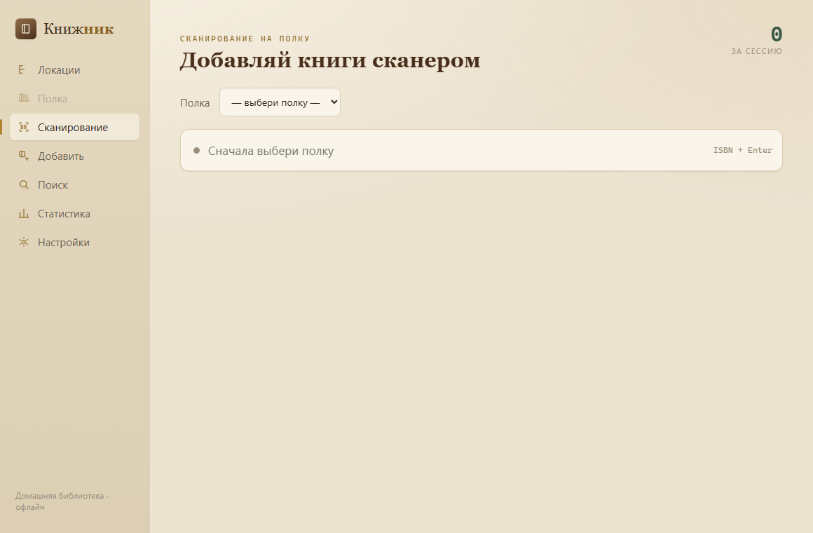
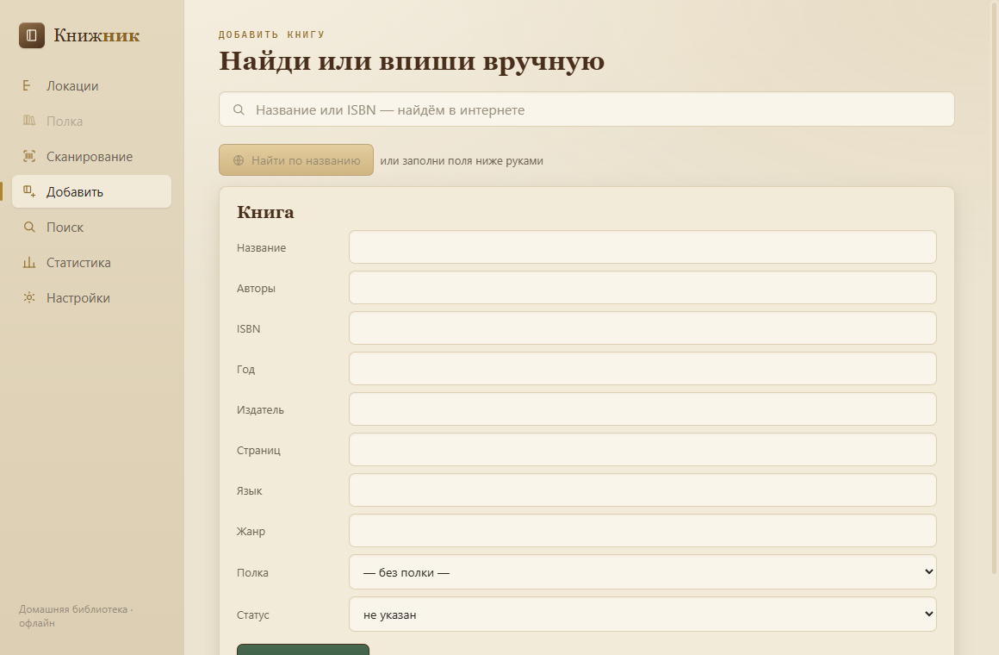

<div align="center">

# 📚 Книжник

**Домашняя библиотека, которая всегда знает, на какой полке стоит книга.**

Локальное десктоп-приложение для каталога домашней библиотеки: заноси полки сканером штрихкодов и за секунды находи, где физически лежит любая книга.

[](https://github.com/Jkaotlic/knizhnik/actions/workflows/ci.yml)
[](https://github.com/Jkaotlic/knizhnik/releases)
[](LICENSE)


[](https://tauri.app)
[](https://www.rust-lang.org)
[](https://react.dev)
[](https://www.typescriptlang.org)
[](https://www.sqlite.org)



</div>

---

## Зачем

У тебя реальные шкафы с книгами. «Книжник» решает три задачи:

1. **Один раз быстро занести живые полки** — режим сканирования: пикнул штрихкод, книга упала на выбранную полку.
2. **За секунды понять, где книга** — поиск по названию/автору/ISBN сразу показывает путь `Комната › Шкаф › Полка`.
3. **Не дать каталогу протухнуть** — переставил книги, выдал почитать — всё отражается в один клик.

Всё локально, **офлайн-first**: без интернета работает всё, кроме подтягивания метаданных из сети.

## Возможности

- 🌳 **Дерево локаций** — комнаты → шкафы → полки, с переносом и переименованием узлов; у полки есть короткий код (`A-3`).
- 📇 **Сканирование на полку** — поле-приёмник в фокусе, ISBN приходит с Enter (сканер = клавиатура), книга падает на полку, лента «только что добавлено» + счётчик сессии.
- ✍️ **Добавление вручную** — с онлайн-поиском по названию или ISBN (Open Library → Google Books) и автозаполнением полей, либо целиком руками.
- 📖 **Вид полки** — книги стоят цветными корешками на деревянном уступе; сверху брейдкрамб и код полки.
- 🔎 **Поиск** — по названию/автору/ISBN/жанру, с путём до полки и пометкой «не на полке», плюс онлайн-поиск по ISBN с добавлением.
- 🤝 **Выдача** — «выдана: Маша»; поиск честно помечает, что книги нет на месте.
- 📊 **Статистика** — всего книг, страниц прочитано, разбивка по статусам и топ-жанры.
- 📤 **Экспорт в CSV** — весь каталог одним файлом, без лок-ина.
- 🔑 **Google Books API-ключ** — опционально, снимает лимит 429 и заметно улучшает покрытие русских книг.

<div align="center">

</div>

## Технологии

- **[Tauri v2](https://tauri.app)** — лёгкий десктоп на системном webview.
- **Rust** — вся бизнес-логика и тесты в бэкенде; фронт тонкий.
- **[rusqlite](https://github.com/rusqlite/rusqlite)** (`bundled`) — локальная база SQLite.
- **[reqwest](https://github.com/seanmonstar/reqwest)** — HTTP к провайдерам метаданных из Rust (никакого CORS).
- **React + TypeScript + Vite** — интерфейс.

Провайдеры метаданных (Open Library, Google Books) скрыты за трейтом `MetadataProvider` и мокаются в тестах — сеть в юнит-тестах запрещена, парсинг проверяется на JSON-фикстурах.

## Установка

Готовые сборки — на странице [**Releases**](https://github.com/Jkaotlic/knizhnik/releases):

- **Windows** — `knizhnik_x.y.z_x64-setup.exe` (NSIS) или `.msi`.
- **macOS** — `.dmg` (universal: Intel + Apple Silicon).

> macOS может предупредить о неподписанном приложении: открой через правый клик → «Открыть», либо `System Settings → Privacy & Security → Open Anyway`.

### Google Books ключ (по желанию)

Без ключа Google быстро упирается в дневной лимит (`429`), и русские книги часто не подтягиваются. Бесплатный ключ (1000 запросов/день) это чинит:

1. [Google Cloud Console](https://console.cloud.google.com/) → создать проект.
2. Включить **Books API** → `APIs & Services → Credentials → Create API key`.
3. В приложении: **Настройки → вставить ключ → Проверить**. Хранится только локально.

## Сборка из исходников

Нужны [Node.js](https://nodejs.org), [Rust](https://rustup.rs) и системные зависимости [Tauri](https://tauri.app/start/prerequisites/) (на Windows — MSVC Build Tools).

```bash
npm install
npm run tauri dev      # запуск в режиме разработки
npm run tauri build    # сборка установщика под текущую ОС
```

Тесты бэкенда (на in-memory SQLite, без сети):

```bash
cd src-tauri && cargo test
```

## Структура

```
src/                     фронт (React + TS)
  components/            экраны: дерево, полка, сканирование, добавление, поиск, статистика, настройки
  api.ts                 типизированные обёртки над командами Tauri
src-tauri/src/
  domain/                чистая логика: ISBN, брейдкрамб, матчинг кандидатов
  db/                    репозитории на подготовленных выражениях + миграции
  providers/             трейт MetadataProvider + Open Library / Google Books
  capture.rs             оркестрация сканирования
  commands.rs            тонкая склейка команд Tauri
docs/superpowers/        спека и план реализации
```

## Лицензия

[MIT](LICENSE) © 2026 asnekhaev
